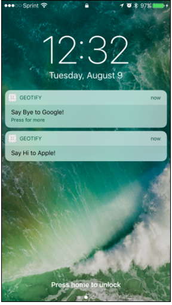

# Geofence-ios
Geofence with swift. This app allows you to add geofences with an accompanying notification that shows when you enter/exit your geofence regions.

### App UI

*Add Geofence / Trigger in Foreground Mode / Trigger in Background Mode*

  

### Emulator testing
- Add custom location by creating new gpx file with exact coordinates. You can look at `/Geotify/TestLocations.gpx` as an example.
- Run application and in xcode, select `Location`. Then in the location options, select the custom location added.
- If you added more than one set of coordinates, then the emulator would visit all location points in the gpx file.

### Resources
 - [Geofence Tutorial and Code](https://www.raywenderlich.com/136165/core-location-geofencing-tutorial)
